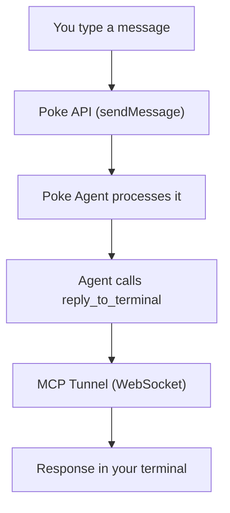

# 🌴 poke-tui

A terminal UI for [Poke](https://poke.com) — chat with your AI assistant without leaving the terminal.

Built with [Ink](https://github.com/vadimdemedes/ink) (React for CLIs) and the [Poke SDK](https://www.npmjs.com/package/poke).

This repository is a fork of [f/poke-tui](https://github.com/f/poke-tui) with Windows tunnel fixes (see below). Upstream is `v0.0.6`; this fork is `0.0.7`.

## Quick start

```bash
# from this fork
git clone https://github.com/nutdevza/poke-tui
cd poke-tui
npm install
node bin/poke-tui.js
```

Or, after a global install of this tree: `poke-tui` / `poke-chat`.

On first run, you'll be guided through a one-time setup. **Kitchen API keys can send messages but cannot create the MCP tunnel** (HTTP 403 Insufficient scope). Use `poke login` (CLI device login) so `~/.config/poke/credentials.json` exists.

## How it works

**poke-tui** connects to your Poke agent through the Poke API. You type messages in the terminal, and Poke responds inline — no need to switch to iMessage, Telegram, or SMS.

Behind the scenes, poke-tui runs a local [MCP](https://modelcontextprotocol.io) server and tunnels it to Poke's cloud using `PokeTunnel`. This gives the agent a `reply_to_terminal` tool it can call to send responses directly back to your terminal.



## Setup

### Option 1: API key (recommended)

1. Go to [poke.com/kitchen/api-keys](https://poke.com/kitchen/api-keys)
2. Generate a new key
3. Run `npx poke-tui` and paste it when prompted

The key is saved to `~/.config/poke-tui/config.json` for future sessions.

### Option 2: Environment variable

```bash
export POKE_API_KEY=your_key_here
npx poke-tui
```

poke-tui checks credentials in this order: `POKE_API_KEY` env var → `~/.config/poke-tui/config.json`.

## Commands

| Command | Description |
|---------|-------------|
| `/help` | Show available commands |
| `/status` | Show connection status |
| `/history` | Last 20 lines in this session |
| `/export` | Write the session to `~/Downloads/poke-tui-*.md` |
| `/attach <path>` | Send a file (max 24KB) as context (`/sendfile` works too) |
| `/clear` | Clear the visible chat |
| `/webhook create <when> \| <do what>` | Create a webhook trigger |
| `/webhook fire <#> {"data":"here"}` | Fire a webhook with JSON data |
| `/webhooks` | List active webhooks |
| `/clear` | Clear the chat |

## Webhooks

Create automated triggers that fire your Poke agent with data:

```
/webhook create When a deploy fails | Summarize the error and suggest a fix
/webhook fire 0 {"repo":"my-app","error":"OOM killed","status":"failed"}
```

## Key bindings

| Key | Action |
|-----|--------|
| `Enter` | Send message |
| `Ctrl-C` | Quit |
| `Esc` | Clear input |

## Requirements

- Node.js 18+
- A [Poke](https://poke.com) account with an API key

## Windows / tunnel fixes (this fork)

Stock poke-tui 404s `reply_to_terminal` on Windows and with Poke's current MCP client:

1. **IPv4 bind** — advertise `http://127.0.0.1:<port>/mcp`, not `localhost` (Windows `localhost` is often `::1`).
2. **Prefixed MCP path** — Poke calls `/{connectionId}/mcp` through the tunnel. Accept that path as `/mcp` instead of returning `Not found`.
3. **CLI login** — tunnel create is `POST /mcp/connections/cli` and needs a `poke login` token, not a Kitchen V2 key.
4. **Orchestrator dispatch** — inbound chat hits Poke's main orchestrator, which does not own MCP tools. The send prompt tells it to dispatch the `poke-tui-terminal` sub-agent.
5. **`/status`** prints the live `Tunnel:` URL and connection id. After a restart, delete `~/.config/poke-tui/state.json` if Poke still aims at a dead id.

Keep the TUI process running. Ctrl-C creates a new tunnel URL; Poke must reattach.

## How the MCP tunnel works

poke-tui starts a lightweight HTTP server locally that implements the [Model Context Protocol](https://modelcontextprotocol.io) (MCP). It exposes two tools:

- **`reply_to_terminal`** — the agent calls this to send its response to your terminal
- **`notify_terminal`** — for short notifications

The server is tunneled to Poke's cloud via `PokeTunnel` (WebSocket-based). When the agent processes your message, it calls the tool, and the response flows back through the tunnel into your terminal.

## Configuration

Config is stored at `~/.config/poke-tui/config.json`:

```json
{
  "apiKey": "your_key_here"
}
```

To reset, delete the file and run `npx poke-tui` again.

## Project structure

```
bin/
  poke-tui.js       Entry point (npx bin), onboarding flow
src/
  app.js            Wires MCP server, Poke client, and TUI together
  mcp-server.js     Local MCP server (raw JSON-RPC over HTTP)
  poke-client.js    Poke SDK + PokeTunnel wrapper
  tui.js            Ink (React) terminal UI
```

## Credits

- Upstream: [f/poke-tui](https://github.com/f/poke-tui)
- [Poke](https://poke.com) by [The Interaction Company of California](https://interaction.co)
- [Ink](https://github.com/vadimdemedes/ink) by Vadim Demedes
- [Poke SDK](https://www.npmjs.com/package/poke)

## License

MIT
